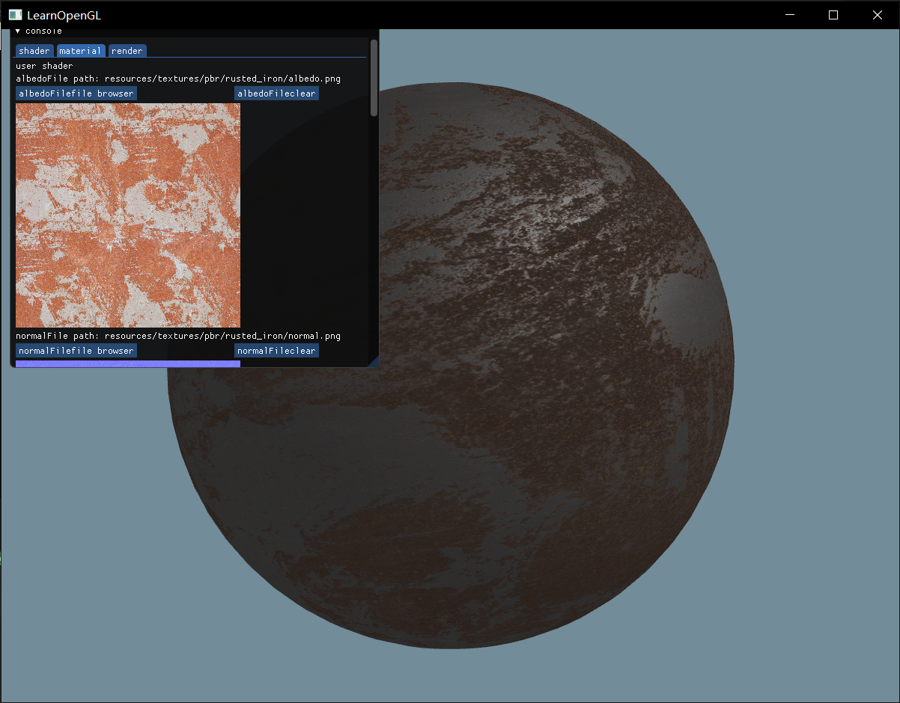
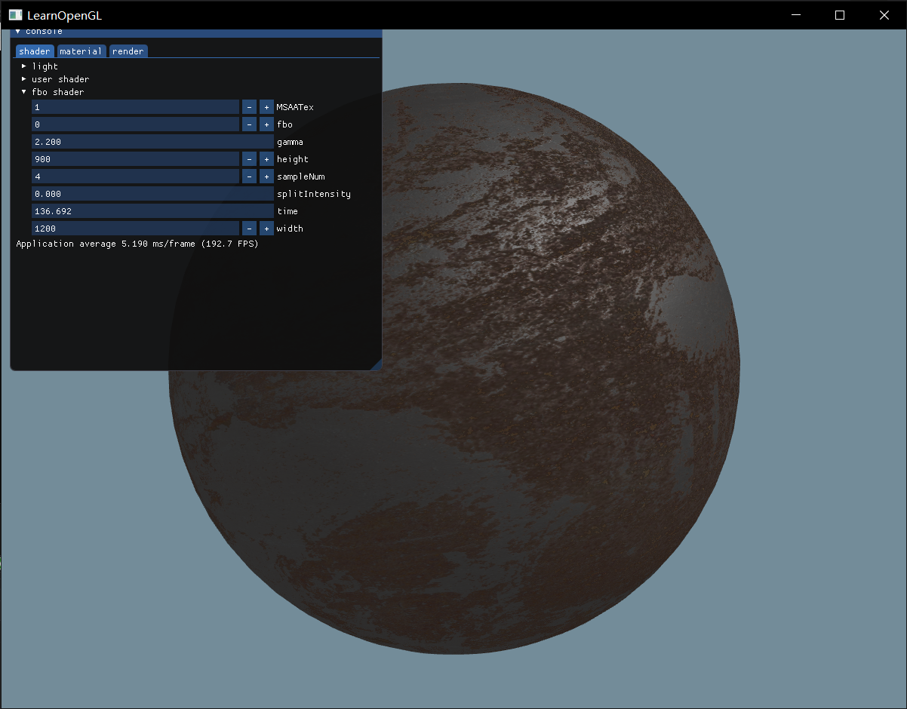

# Material Viewer with OpenGL

## What it is
A small app for viewing your material and shader effect with gui, just like any other game engine does.

## Why use it
No, you should not, since it's a learning project for my graphic course, which lack of basically strcture design.

## How to use
Using camke and vcpkg to build on Windows. Configure your own vcpkg path in camke setting to get third lirbary(glm, glfw, glad).
press Tab to call GUI interface, hold mouse left button to rotate material ball.

## Effect
Support PBR workflow.  

You can watch and edit uniforms in your shader at run-time.  

## feature(bug)
Changing window size can cause app crash.  
Some of the uniform in shader tab can not be changed.  
IBL reflect light part is not completed, so you would get a weeker visual experience compare to usual PBR material.  
Scene can only be seen after you fist press Tab.
